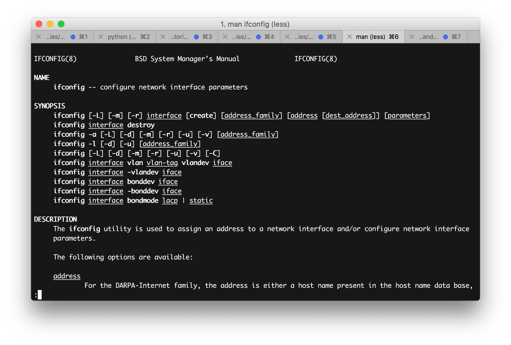
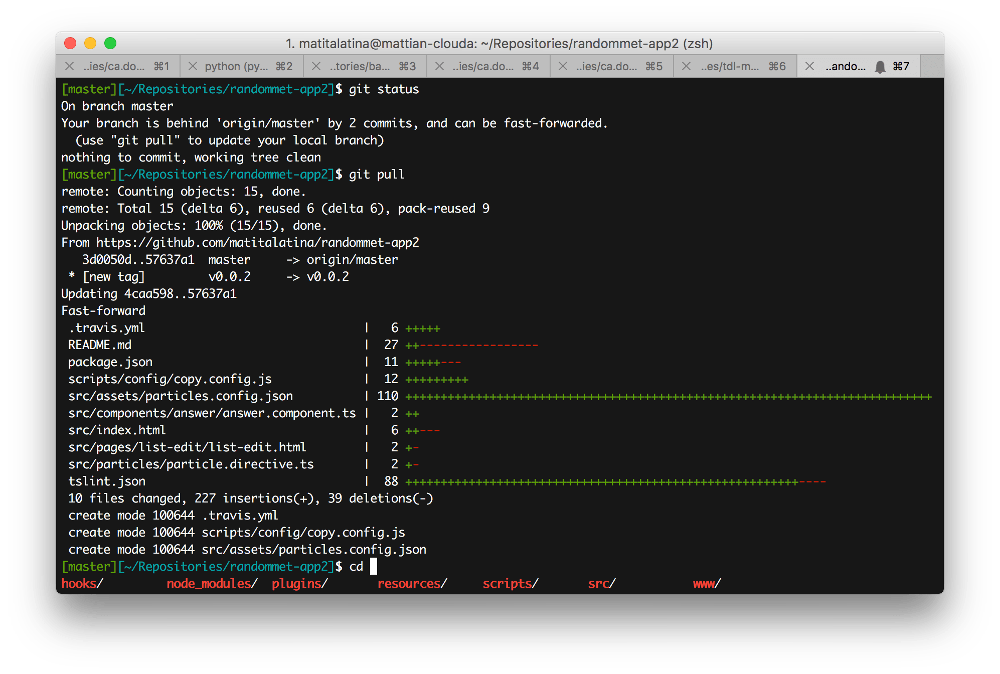
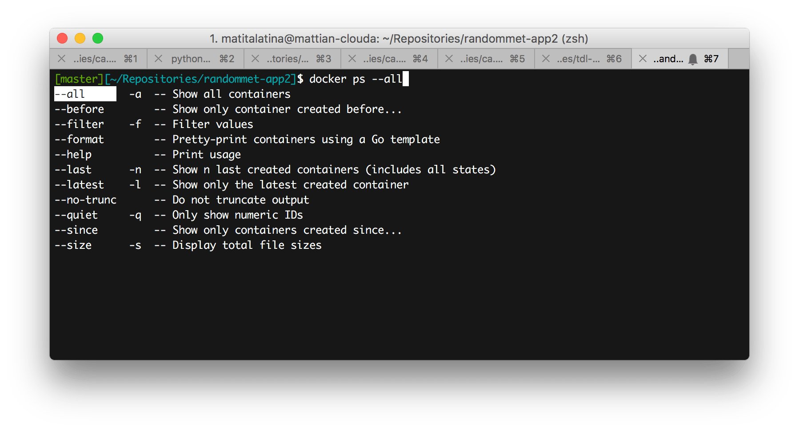
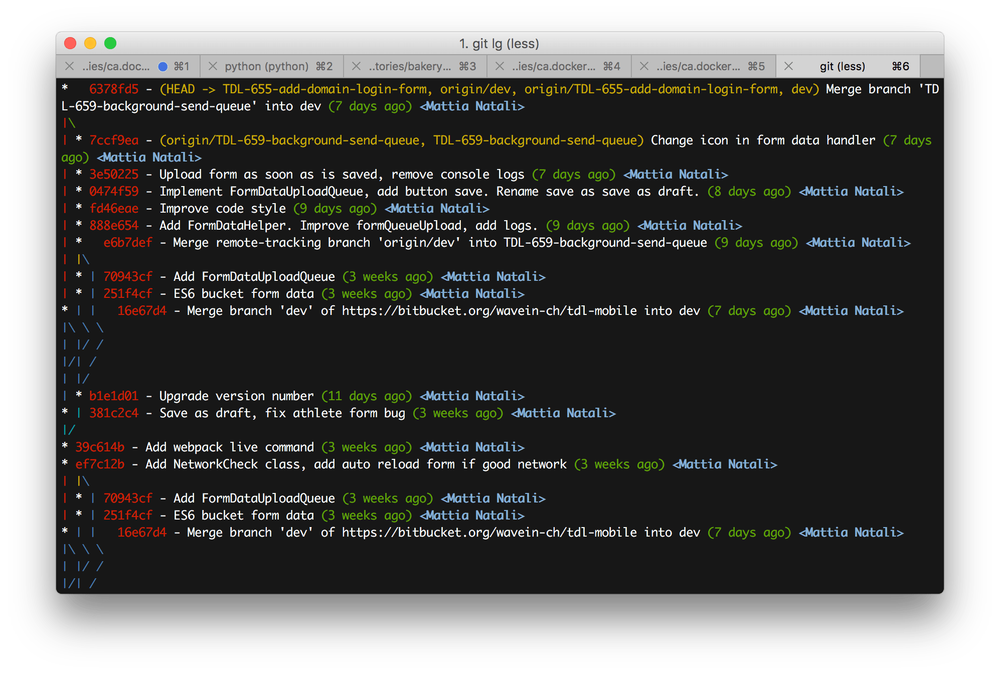

Se state leggendo questo blog post immagino che siate più o meno nella mia stessa situazione. Siete uno sviluppatore e avete a disposizione 8 ore al giorno per lavorare: in questo lasso di tempo dovete revisionare il codice di altri, fare meeting, gestire le vostre milioni di issue e magari anche quelle di altri, aiutare chi vi chiede aiuto, pensare a come raggiungere i propri obiettivi e infine programmare quello che avete pensato.

Fare tutte queste cose e rientrare nelle 8 ore giornaliere prefissate è difficile senza deludere le aspettative di nessuno. Quindi da bravi ingegneri/sviluppatori state cercando di ottimizzare qualsiasi cosa.

In questo blog post vi spiegherò come ho cercato di ottimizzare il mio tempo passato davanti al terminale. Mi concentrerò soprattutto sul sistema operativo Mac, che è quello su cui lavoro attualmente.

In questa guida non voglio spiegare come si utilizza il terminale. Quello per me è un prerequisito. Il mio fine è di condividere con voi tanti piccoli trucchetti che vi faranno risparmiare tempo nella vostra quotidianità lavorativa in modo tale da concentrarvi maggiormente sull'attività che effettivamente porta valore: la programmazione.

# Le basi

## Velocizziamo il cursore

Iniziamo con una piccola ottimizzazione tanto semplice quanto efficace, ancora prima di aprire il terminale. Molte volte nel terminale o nel proprio IDE occorre spostare il cursore. Tenendo premuto le frecce direzionali il cursore si sposta finchè non rilasciamo il tasto. Bene, fin qui nulla di nuovo. La cosa esasperante è la lentezza con cui questo cursore si sposta! Molte persone che vedo, per fare veloce, cominciano a premere compulsivamente le frecce oppure semplicemente attendono secondi preziosi finchè il cursore si sposta nella posizione desiderata.

Una semplice ottimizzazione che tutti dovrebbero fare è di **diminuire il tempo in cui inizia la ripetizione del tasto e l'intervallo di tempo tra una ripetizione e l'altra**.

Per farlo è molto semplice. Andiamo nel Mac in Settings -> Keyboard -> Tab Keyboard. Impostate *Key Repeat* a *Fast* e *Delay Until Repeat* a *Short*. Ora provate e la differenza sarà enorme. So che all'inizio sembra troppo veloce il cursore, ma poi ci si abitua e non si torna più indietro!


## Shortcuts

Questo consiglio vale in generale in ogni programma. **Se utilizzate spesso la stessa funzione, cercate di imparare la sua scorciatoria da tastiera**. È sicuramente più veloce non staccare le dita dalla tastiera. Capita che la scorciatoia non possa esistere per la vostra funzione, fortunatamente il più delle volte nelle impostazioni si può creare. Vi consiglio di spendere un po' del vostro tempo nella creazione di queste shortcuts: risparmierete tempo prezioso nel lungo periodo.

## iTerm

Il terminale del Mac è buono, ma se volete ancora di più potete utilizzare [iTerm](https://www.iterm2.com). Sostanzialmente è come il terminale nativo ma ha le seguenti funzionalità aggiuntive che aumenteranno la vostra produttività:

* **Ricerca migliorata**: premete `cmd + F` e aprite la modalità ricerca. Scrivete la parola chiave da cercare e subito vi evidenzierà la vostra parola nel terminale. Usando `cmd + G` e `cmd + shift + G` potete cercare la parola successiva o precedente.

* **Split panels**: è possibile suddividere sia verticalmente (`cmd + D`) che orizzontalmente (`cmd + shift + D`) la vista in modo da avere più terminali in un'unica pagina. Molto utile se avete più programmi avviati e avete bisogno di monitorarli contemporaneamente.

* **Profili personalizzabili**: con un profilo è possibile customizzare completamente il terminale come colori, shortcuts. Se passate tanto tempo collegati a macchine remote è facile confondersi tra le varie tab aperte. Un ottimo modo per evitare di fare pasticci è di utilizzare profili diversi per macchine con finalità diverse. Il nostro buon DevOp utilizza quotidianamente questa tecnica: per la macchina di produzione ha un bellissimo sfondo rosso vivo, così capisce chiaramente di stare attento e di non starci per troppo tempo. Per l'environment di stage è blu, il resto sfondo nero.

* Se siete curiosi per iTerm vi consiglio di leggere le [altre feature degne di nota](https://www.iterm2.com/features.html), ma soprattutto di provarlo!


## Ordinaria amministrazione 

Ecco qui una lista di trucchetti che utilizzo quotidianamente nel terminale. Ho scritto tutti quelli che mi vengono in mente, alcuni saranno ovvi per chi vive tutto il giorno davanti al terminale, altri spero di no ?.

* `tab`: Bastano poche lettere di ciò che volete scrivere, poi premete `tab` per l'autocompletamento. Questo è molto utile per esempio nella navigazione tra tab.
* `sudo !!`: quante volte avete scritto `apt-get install` senza dare i permessi di root? Molti, dopo aver letto il messaggio di errore premono `freccia su` e poi spostano in cursore all'inizio del comando e finalmente inseriscono la parola `sudo` per diventare root... Quando tempo perso! Basta scrivere `sudo !!` e boom! Fatto. In sostanza `!!` viene sostituito con il comando precedente ed è proprio quello che volevamo.
* `cd`: ritorna nella propria home. Perchè scrivere `cd ~` o peggio ancora `cd ../../../../../` per tornare alla home se basta `cd`?
* `cd -`: ritorna nella directory precedente. Molto simile è il comando `git checkout -`: fa il checkout del branch su cui lavoravamo in precedenza.
* `lsof -i :<PORT>`: solo per Mac. Questo comando serve per identificare il programma che sta usando la porta `<PORT>`. Molto utile quando un programma si blocca in background e voi avete bisogno disperatamente della porta libera. Una volta eseguito il programma vi basta prendere nota del PID del programma e poi `kill <PID>`. Ora la porta è libera!
* Concatenare i comandi: perchè stare a fissare un comando che finisca per poi eseguire il prossimo? Usando `&&` e `;` è possibile concatenare più comandi. `&&` esegue il secondo comando solo se il primo si è concluso correttamente, mentre `;` lo esegue a prescindere.
* `ctrl + c`: serve per chiudere le applicazioni ma anche per cancellare velocemente quello che stiamo scrivendo.
* `ctrl + a` e `ctrl + e`: porta rispettivamente all'inizio e alla fine il cursore nel comando che stiamo scrivendo.
* `ctrl+l`: pulisce il terminale, molto più veloce rispetto a scrivere `clear`!
* `!$`: riprende l'ultimo argomento del comando precedente. Molto utile in casi come questi
    `mkdir -p creo/una/nuova/cartella/ && cd !$`
    Come avrete intuito sto creando una cartella, ed una volta creata ci entro senza dover scrivere tutto il path di nuovo.
* `man <APPLICAZIONE>`: quante volte vi è capitato di non ricordarvi le opzioni di un comando e siete andati online a cercare la documentazione? Non serve andare online! Basta scrivere `man` seguito dall'applicazione e avrete tutta la documentazione a portata di mano senza googlare.


* `cmd + t` e `cmd + w`: rispettivamente apre e chiude una nuova tab del terminale. Se ci fate caso questi comandi sono "universali", ossia funzionano anche con le tab del browser, del finder, del vostro text editor preferito ecc.
* `open .`: apre nel Finder la cartella in cui ci troviamo.

### Navigazione tra i comandi ed auditing

* `last`: mostra chi è connesso con il terminale alla macchina o chi si è connesso in precedenza.
* `w`: molto simile a `last`. Mostra le persone correntemente connesse alla macchina.
* `freccia su`: inserisce il comando eseguito precedentemente. Molto utile per revisionare il comando o per modificarlo in caso di typo. Se si continua a premere `freccia su` si torna indietro nella history.
* `history`: mostra tutti i comandi eseguiti. Insieme al comando `grep` è molto facile ricercare un comando. Per esempio avevate avviato un'app utilizzando `runserver` ma non vi ricordate tutte le opzioni a memoria? Vi basterà scrivere un pezzo del comando, nel nostro caso scriviamo `history | grep runserver`.
* `ctrl + r <TEXT_SEARCH>`: si chiama *reverse-i-search* e significa "cerca nel passato un comando simile a questo". Insomma è come il comando precedente solo che è ancora più veloce. Per esempio possiamo premere `ctrl + r` e poi scrivere `runserver` per avere nel terminale il comando che stavamo cercando. Se il comando che stavate cercando non è l'ultimo ma uno precedente, continuate a premere `ctrl + r` finchè non ritrovate il comando desiderato!

## Spingiamoci oltre!

### Fuck!

Capita a tutti di sbagliare a scrivere qualche comando: quando scriviamo un typo e vediamo che il terminale ci risponde picche la prima cosa che pensiamo è "fuck". Con [thefuck](https://github.com/nvbn/thefuck) possiamo esternare la nostra rabbia in modo produttivo!
Questa app è tanto semplice quanto geniale. Se sbagliamo a scrivere un comando, ci basta scrivere `fuck` nel terminale, in questo modo questa app ci ripropone il comando precedente scritto correttamente. Vedetelo come un **correttore automatico del terminale**.


L'installazione e molto semplice: avendo installato [Homebrew](https://brew.sh/) ci basta scrivere 

```
brew install thefuck
eval $(thefuck --alias)
```

Bene! Ora se sbagliate a scrivere qualche comando arrabbiatevi e scrivete `fuck` che sarete più produttivi!


### Zsh

Spesso ci ritroviamo bash come shell installata di default. Se volete avere quella marcia in più vi consiglio di usare Zsh insieme al plugin Oh My Zsh! Questa combo vi permetterà di essere più produttivi per i seguenti motivi:

* **Autocompletamento delle cartelle migliorato**: una migliore navigazione tra le scelte proposte.
* **Autocompletamento per i programmi più utilizzati**: Git, Docker, npm, Django sono i plugin di Oh My Zsh che utilizzo, ma [ce ne sono molti altri](https://github.com/robbyrussell/oh-my-zsh/tree/master/plugins)!
* **[Temi completamente configurabili](https://github.com/robbyrussell/oh-my-zsh/wiki/themes)**: ci sono moltissimi temi pronti all'uso, sicuramente ne troverete uno che soddisferà i vostri gusti personali. Il mio preferito è `eastwood`.
* **Maggiore integrazione con Git**: appena entriamo in una cartella che contiene un progetto versionato con Git, possiamo notare che viene mostrato il branch su cui siamo e anche un piccolo alert quando non abbiamo committato e pushato tutto il nostro codice. Grazie a questi piccoli aiuti risparmieremo molti `git status`.
* **Ricerca di comandi precedenti migliorata**: scrivete solo l'inizio di un comando, poi premendo `freccia su` vi mostra il comando precedentemente utilizzato che inizia proprio nello stesso modo.


#### Installazione

Se volete installare Zsh con Oh My Zsh! questi sono i passi da seguire:

```
brew install zsh zsh-completions
sh -c "$(curl -fsSL https://raw.github.com/robbyrussell/oh-my-zsh/master/tools/install.sh)"
``` 

Ora riavviate la shell, per utilizzare Zsh vi basta scrivere `zsh`.

Se volete che Zsh diventi la vostra shell di default allora scrivete

```
chsh -s $(which zsh)
```

#### Cambio del tema

I file di configurazione di Zsh si trovano nel file `~/.zshrc`. Con il vostro editor preferito andate a modificare la variabile `ZSH_THEME`. Se non sapete quale tema scegliere, potete utilizzare la modalità `random`: così ogni volta che aprite una shell avrete un tema diverso. Quando ne individuate uno che vi piace, prendete il nome del tema che vi appare all'avvio e andate a scriverlo nella variabile sopra citata.

Io, come ho già detto in precedenza, sto utilizzando `eastwood`. Ha dei colori molto rilassanti e non distrae troppo l'attenzione rispetto ad altri temi.





#### Modifica dei plugin

Sempre nel file `~/.zshrc` possiamo trovare la variabile `plugins`. I plugins potete vederli come dei miglioramenti nell'autocompletamento per delle applicazioni che utilizzate spesso nel terminale.

Io attualmente uso questa configurazione.

```
plugins=(django npm docker)
```

Vi ricordo di separare i plugin con lo spazio e non con la virgola. Ovviamente [Zsh offre molti altri plugins](https://github.com/robbyrussell/oh-my-zsh/tree/master/plugins), sceglietene il minimo indispensabile perchè potrebbero rallentare l'avvio del terminale.





### Alias, alias ovunque!

Nel terminale si possono aggiungere degli alias per velocizzare l'esecuzione di uno o più comandi. Se vi accorgete di **scrivere sempre lo stesso comando** (o addirittura una serie di comandi) allora significa che è giunta l'ora di dover **aggiungere un alias**.

Per aggiungere un alias è semplice: bisogna aggiungerli nel file `~/.bash_profile` se usate bash oppure `~/.zshrc` se usate Zsh.
La sintassi per aggiungerne uno è la seguente:

```
alias <ALIAS>="<COMMAND>"
```

Ecco qui alcuni miei alias come esempio:

* `alias gbd="git branch | grep -v '*' | xargs git branch -D"`: eseguendo `gbd` (Git Branch Delete) verranno cancellati tutti i branch locali di Git del progetto contenuto nella cartella. Avviatelo solo se siete sicuri di quello che fate!
* `alias pycc='find . -name "*.pyc" -exec rm -f {} \;'`: eseguendo `pycc` (pyc clean) cancellerete ricorsivamente tutti i file compilati python presenti nella cartella. Molto utile se si fa refactoring in Python e abbiamo il timore che i file compilati non rispettino più il codice sorgente.
* `alias yda='youtube-dl -x --audio-format m4a --audio-quality 160k'`: eseguendo `yda <YOUTUBE_URL>` (YouTube Download Audio) scaricherete il file audio di un video di YouTube. Questo comando funziona solo se avete seguito la mia guida su [come scaricare un video da YouTube](/come-scaricare-i-video-da-youtube-con-il-terminale/).
* `alias ddev='docker-compose -f <ABSOLUTE_PATH_DOCKER_YAML_FILE>'`: eseguendo `ddev <DOCKER_COMPOSE_COMMAND>` (Docker dev) potete impartire qualsiasi al vostro Docker Compose senza preoccuparvi della cartella in cui vi trovate. Senza questo comando ero sempre costretto ad andare nella cartella del mio progetto Docker Compose `cd <PATH_TO_DOCKER_COMPOSE_PROJECT>` e poi scrivere `docker-compose -f <DOCKER_YAML_FILE> <DOCKER_COMPOSE_COMMAND>`... Tutto tempo buttato!
* `alias c<PROJECT_NAME>='cd <PROJECT_NAME_ABSOLUTE_PATH>'`: se avete un progetto su cui ci lavorate quotidianamente vi consiglio di creare un alias per raggiungerlo velocemente. Io come convenzione utilizzo la lettera `c` iniziale che ricorda il comando `cd` e poi il nome del progetto.


#### Git

Anche **Git supporta un suo meccanismo di alias interno**. Aprite o create il file `~/.gitconfig`. Al suo interno aggiungiamo

```
[alias]
    st = status -sbu
    lg = log --color --graph --pretty=format:'%Cred%h%Creset -%C(yellow)%d%Creset %s %Cgreen(%cr) %C(bold blue)<%an>%Creset' --abbrev-commit
```

Come si può intuire abbiamo aggiunto la sezione alias e abbiamo aggiunto due nuovi alias git.
Una volta riavvito il terminale possiamo usare:

* `git st`: una versione modificata di `git status`.
* `git lg`: mostra l'albero dei commit.

Ovviamente questi sono due miei comandi ma nessuno vi vieta di crearne dei vostri!




#### SSH

Anche l'accesso ad una macchina remota può essere velocizzato. Immagino che le macchine a cui vi connettete da remoto siano sempre le stesse, ed ogni volta scrivere nel temrinale `ssh <USERNAME>@<REMOTE_ADDRESS> -i <PRIVATE_KEY_PATH>` è lungo, tedioso e difficile da ricordare. È tutta un'altra storia se noi potessimo connetterci semplicemente scrivendo `ssh <ALIAS>` dove `<ALIAS>` è il nome che noi abbiamo dato alla macchina remota. Tutto questo è possibile grazie al file di configurazione `~/.ssh/config`. Se il file non è presente, potete crearlo scrivendo `touch ~/.ssh/config`. Tramite questo file **possiamo salvare delle connessioni remote e richiamarle tramite un'alias**, senza necessariamente riscrivere tutti i parametri ogni volta.

Il file `~/.ssh/config` ha la seguente sintassi:

```
Host <ALIAS>
    HostName <REMOTE_ADDRESS>
    Port <PORT>
    User <USERNAME>
    IdentityFile <PRIVATE_KEY_FILE>
```

Sostituite le variabili scritte tra le parentesi angolate con i vostri parametri: in questo modo invece di scrivere

```
ssh <USERNAME>@<REMOTE_ADDRESS>:<PORT> -i <PRIVATE_KEY_FILE>
```

ora vi basta scrivere

```
ssh <ALIAS>
```

molto ma molto più veloce ed immediato.
Nel file di configurazione sono obbligatori i campi `HostName` ed `User`, il resto sono opzionali. Si possono aggiungere più Host qualora abbiate diverse macchine a cui accedete da remoto.

I parametri SSH disponibili non sono solamente questi, se avete bisogno di funzionalità avanzate come il tunnelling vi consiglio di leggere la [guida ufficiale su SSH Config File](https://www.ssh.com/ssh/config/).


### Curiosità

Questi comandi non sono legati alla produttività, ma sono pur sempre degni di nota.

* `say '<TEXT>'`: lo sapevate che il Mac può parlare e lo si può far parlare tramite il terminale? Combinando questo comando con `ssh` possiamo far parlare un Mac anche da remoto. Quindi nessuno ci vieta di mandare un messaggio d'amore alla propria ragazza attraverso il comando `ssh girlfriend@<IP_ADDRESS> say 'I love you!'`, provate a farlo e osservate la sua reazione! (Spoiler: non apprezzerà ve lo posso assicurare ?).
* `yes`: se avete un gelone temporaneo e avete bisogno di una fonte di calore, allora vi consiglio di avviare `yes` da terminale. Questo comando non fa altro che mandare la CPU al 100%!

# Conclusioni

Spero che tutti questi miei trucchetti vi aiutino nel vostro quotidiano a raggiungere i vostri obiettivi lavoritivi nel minor tempo possibile. Sicuramente ci saranno altri milioni tips and tricks che non ne sono a conoscenza: se ne imparo degli altri cercherò di aggiungerli qui in modo da condividerli con voi.

A presto, buon lavoro e alla prossima!
